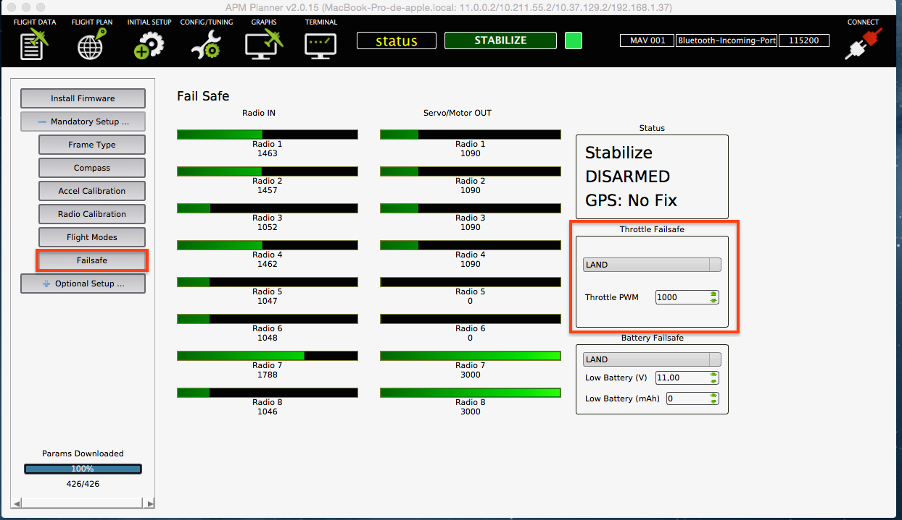
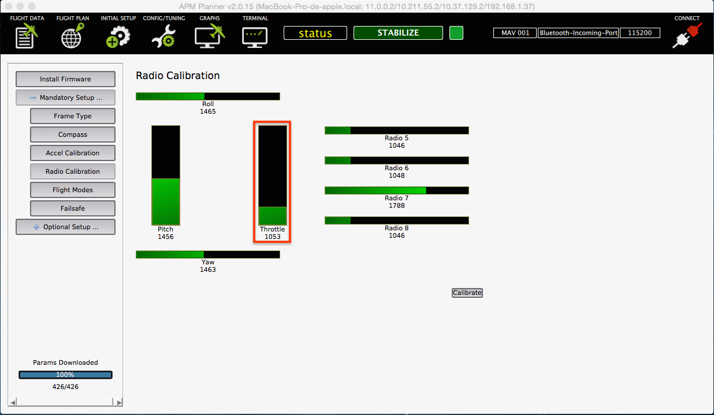
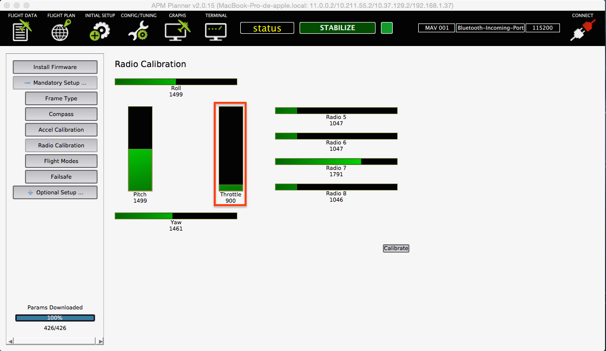
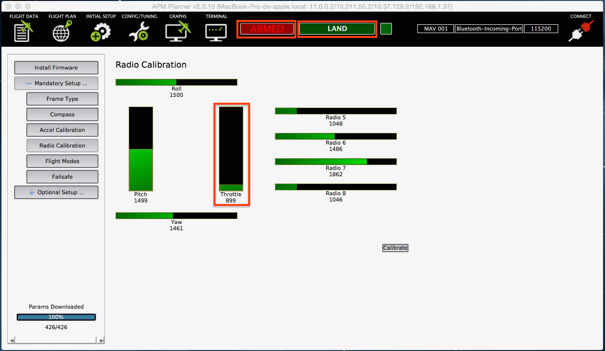
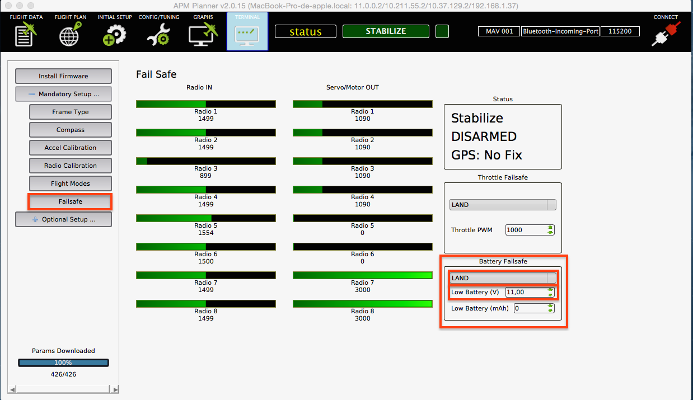
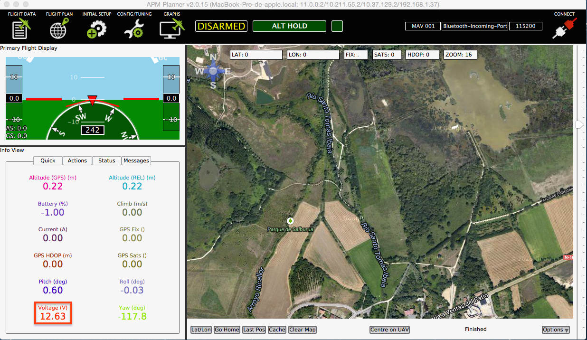
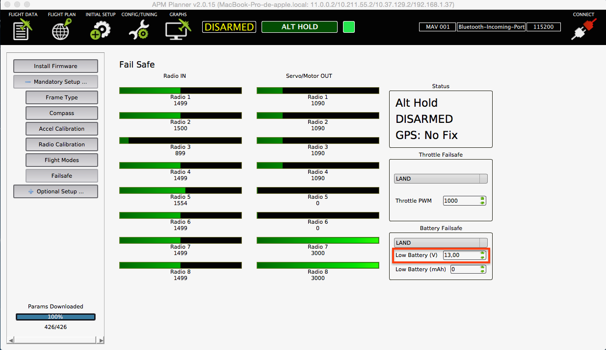
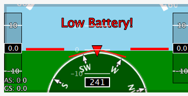

#Failsafe

	A fail-safe or fail-secure device is one that, in the event of a specific type of failure,
	responds in a way that will cause no harm, or at least a minimum of harm, to other devices or
	danger to personnel.

Taking this definition as a start point, drones, obviously, also needs security measurements. You could configure [Erle-Copter](http://erlerobotics.com/blog/erle-copter/) to enable failsafes. In this section, we will explain how to activate some of them (the most meaningful ones). For more info check [this](http://copter.ardupilot.com/wiki/configuration/) site.

---
*Note: As user might not have GPS, this section will show how to setup failsafes using **land** mode*

---

###Radio Failsafe

[Erle-Copter](http://erlerobotics.com/blog/erle-copter/) supports Return-To-Launch/Land in cases where contact between the Pilot’s RC transmitter and the flight controller’s receiver is lost.

####When the failsafe will trigger

If enabled and set-up correctly the radio failsafe will trigger if:

+ The pilot turns off the RC transmitter
+ The vehicle travels outside of RC range (usually at around 500m ~ 700m)
+ The receiver loses power (unlikely)
+ The wires connecting the receiver to the flight controller are broken (unlikely). 

####Set-up for No-Signal method

Follow the next steps to enable it:

+ Power [Erle-Copter](http://erlerobotics.com/blog/erle-copter/) up and connect to the mission planner and select Initial Setup >> Mandatory Hardware >> Failsafe.
+ Set the **Throttle Failsafe** Option to **LAND** to force the vehicle to Land immediately if it loses RC contact. Because the throttle is not pulled low, there is no need to set the “FS Pwm” value.

####Testing

Make the next tests in order to verify is working fine:

+ Ensure the minimum value of the RC and RC off PWM value are different: Turn on the RC with the **throttle** to the minimum, enter into the **RC calibration** window and check the value:

Now turn off the RC and check that the value descends:

+ Switch to **stabilize mode**, arm your motors but keep your throttle at zero. Turn off your transmitter. The motors should disarm immediately (red led will start flashing, **DISARMED** will be displayed in the Mission Planner’s Flight Data screen).

+ Switch to **stabilize mode**, arm your motors and raise your throttle to the mid point. Turn off your transmitter. The Flight Mode should switch to **LAND**.

Notice that the value of the **throttle** is lower than the minimum value (~1053) when the RC is **on** and that **Erle-Copter** has changed to **Land** mode.

###Battery Failsafe

[Erle-Copter](http://erlerobotics.com/blog/erle-copter/) supports the activation of Battery based failsafe. Our [Power Module](https://erlerobotics.com/blog/product-category/components/power-m/) enables battery monitoring. Right now (19-03-2015), battery voltage reading is supported in the latest Autopilot. Download the latest binaries from our [repository](https://github.com/erlerobot/ardupilot-binaries)!

Thanks to this reading, the user could know the battery voltage using a [GCS](http://erlerobotics.gitbooks.io/erle-robotics-erle-brain-a-linux-brain-for-drones/content/en/GCS/index.html).

This failsafe permits to you to minimize the risks of having a sudden death of [Erle-Copter](http://erlerobotics.com/blog/erle-copter/) and enables a better use of your LiPo batteries.

####When the failsafe will trigger

If enabled and set-up correctly the battery failsafe will trigger if battery voltage drops below the threshold voltage determined (10.5v by default).

Also notice that if you try to arm [Erle-Copter](http://erlerobotics.com/blog/erle-copter/) having a lower battery voltage than the trigger threshold one, an **low battery** error will show up (in the GCS in case you are using it).

####Battery Failsafe set-up

**Note: The use of a voltage sensing [Power Module](https://erlerobotics.com/blog/product-category/components/power-m/) is mandatory!**

+ Power [Erle-Copter](http://erlerobotics.com/blog/erle-copter/) up and connect to the mission planner and select Initial Setup >> Mandatory Hardware >> Failsafe.
+ In the **Battery Failsafe** square, select **LAND** as the flgiht mode and set the voltage which you would like to trigger the failsafe (10.5~11v recommended).

---
**Note: We are working on having current measurement, this will be used to establish current based failsafe.**

----

####Testing

Once you have activated the failsafe, you could check that you cannot arm  [Erle-Copter](http://erlerobotics.com/blog/erle-copter/). Follow the next steps:

+ Power [Erle-Copter](http://erlerobotics.com/blog/erle-copter/) up and connect to a [GCS](http://erlerobotics.gitbooks.io/erle-robotics-erle-brain-a-linux-brain-for-drones/content/en/GCS/index.html).
+ Check the voltage in **Info View**.

+ In the Battery failsafe tab, set the **Low battery** voltage higher than the voltage remaining.

+ Finally, try to arm [Erle-Copter](http://erlerobotics.com/blog/erle-copter/). Low battery error should show up.

**Don't forget to restore desired low battery voltage value again!**

